# Звіт до роботи
## **Тема**: Робота у віртуальних середовищах
## **Мета роботи**: Ознайомити з принципами ізольованих віртуальних середовищ у Python, розглянути використання pipenv, venv, poetry  для створення, активації та керування середовищами.
---
### Скріншоти:

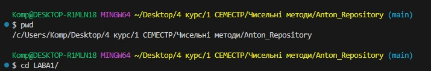
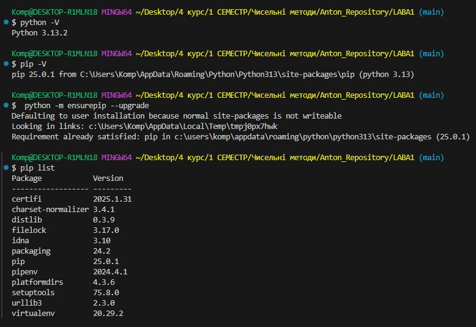
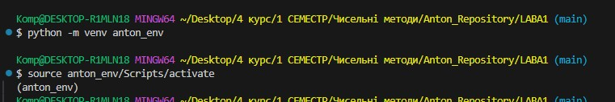
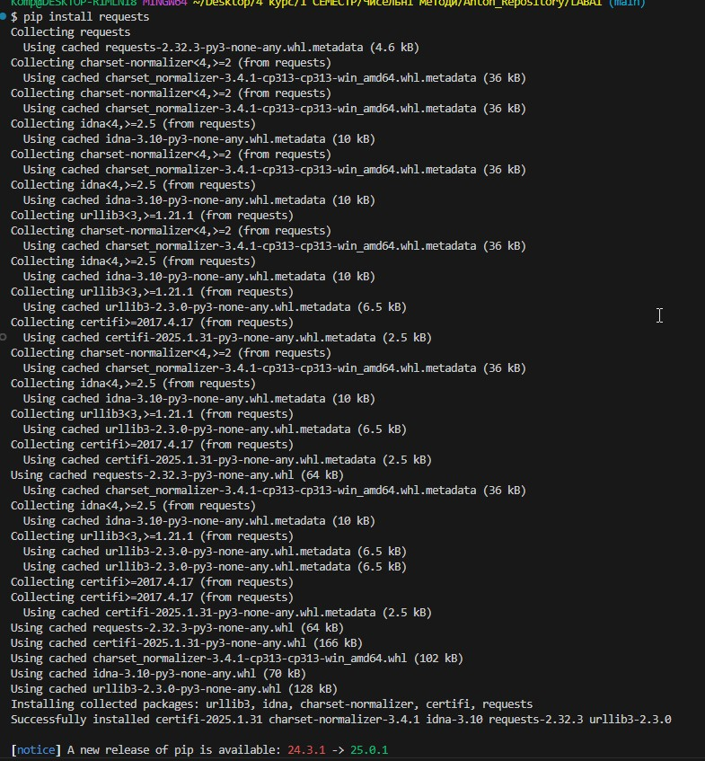
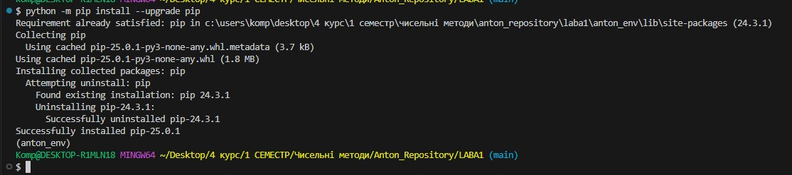
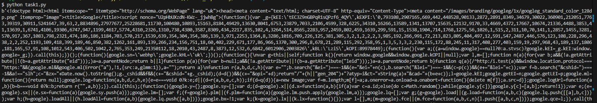
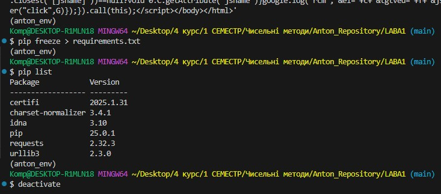
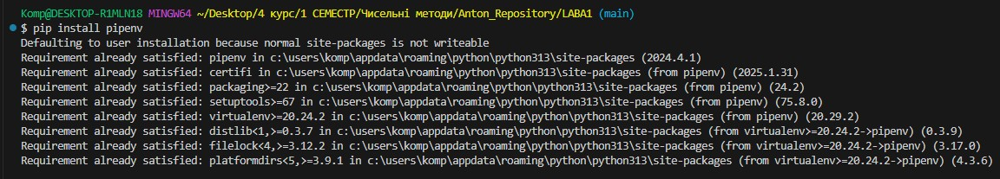
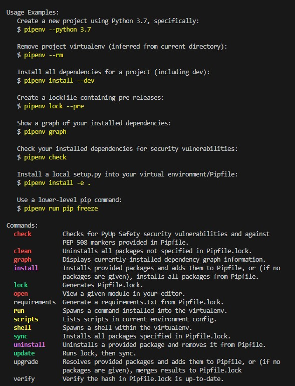
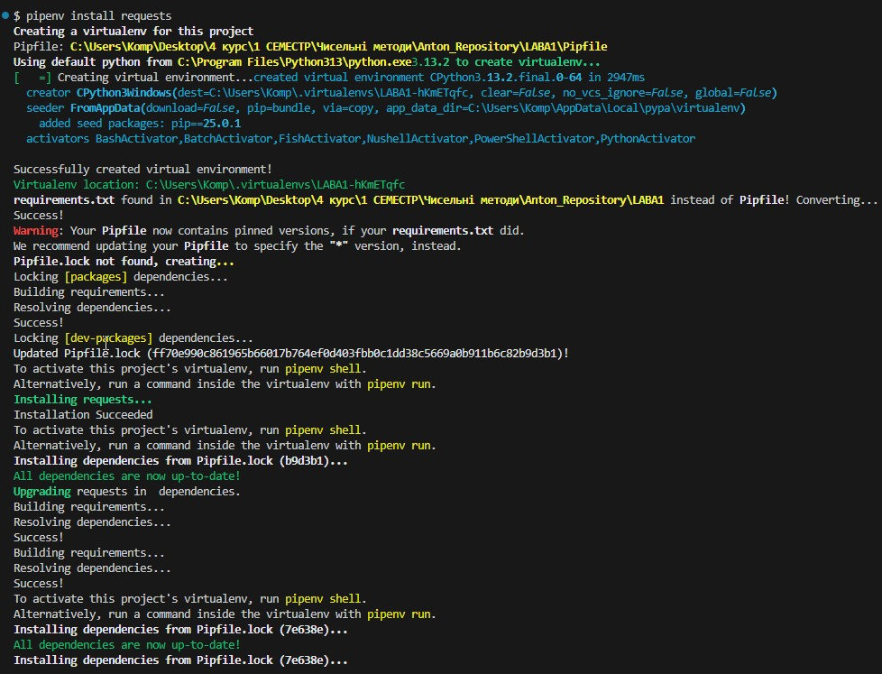
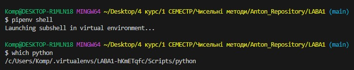

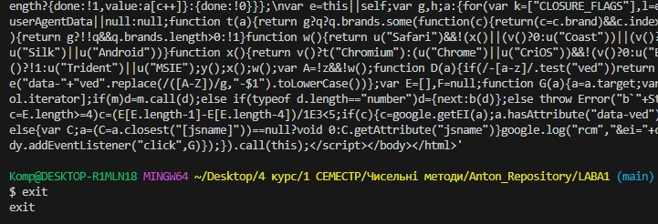
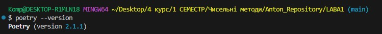
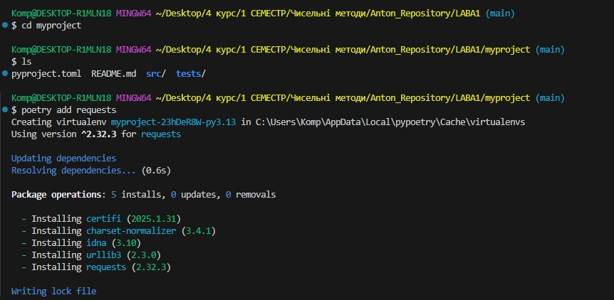
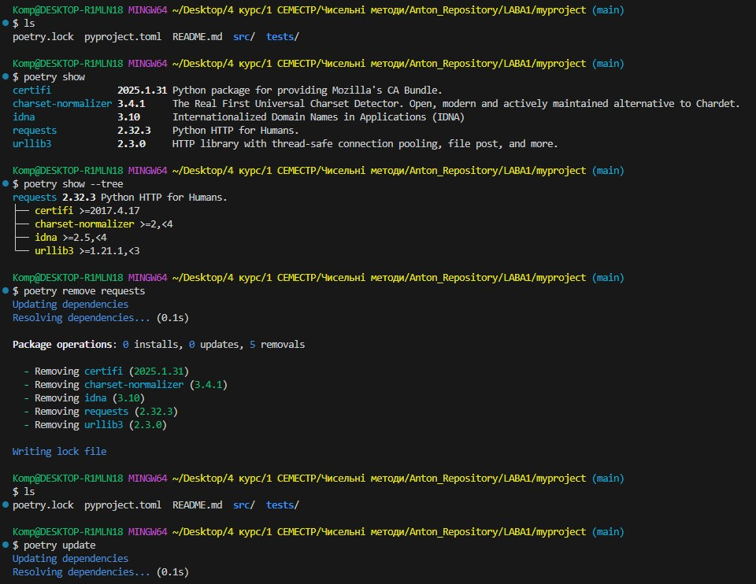
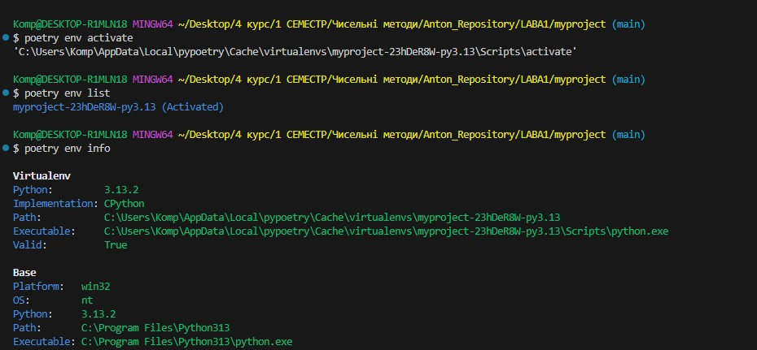
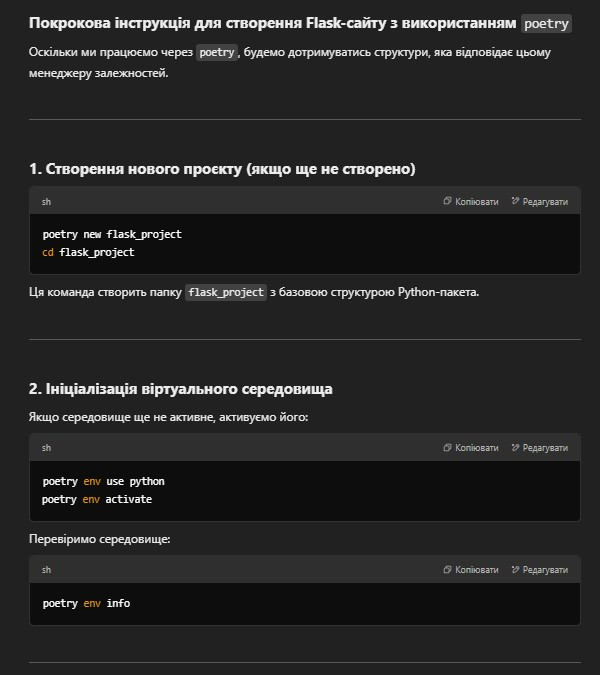
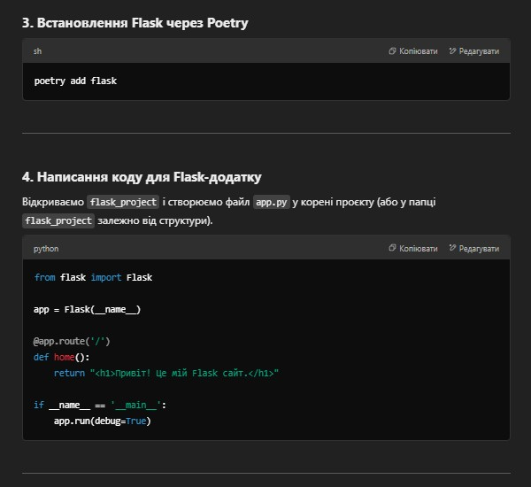
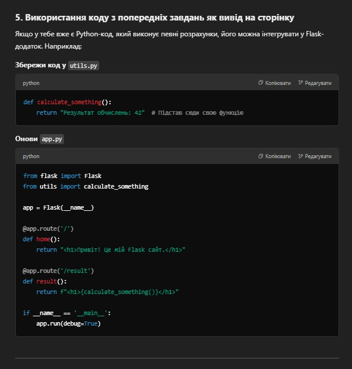
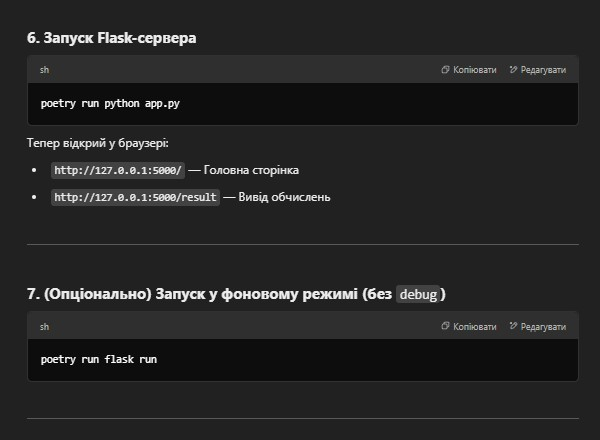
-----------------------------------

## **Висновок**: Ознайомився з принципами ізольованих віртуальних середовищ у Python, розглянув використання pipenv, venv, poetry  для створення, активації та керування середовищами.

---